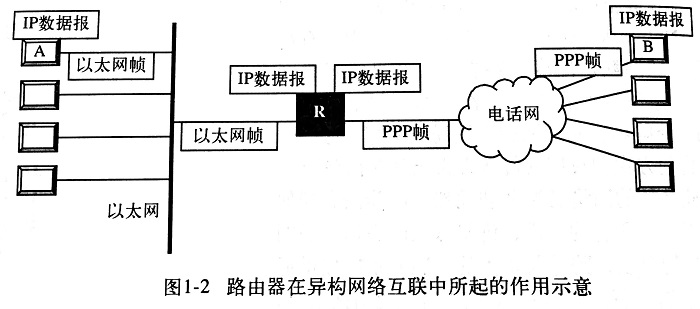
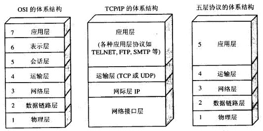
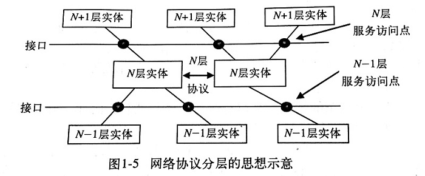
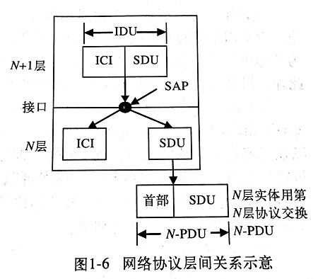

# 第1章 TCP/IP概述

## 1.1 网络互联与TCP/IP

学校的校园网用以太网技术，家庭则用电话网拨号接入互联网...

> 问题是：以太网帧格式和拨号使用的PPP帧格式不同（PPP即点到点协议），物理地址形式也不同，不同网络怎么互联？

> Vinton的思路：对每个网络，内部用自己的通信协议，与其他网络通信时用**TCP/IP协议族**。

### 1.1.1 用IP实现异构网络互联

在TCP/IP协议族中，能够屏蔽底层物理网络的差异，向上提供一致性的协议--- **IP**

**IP协议（Internet Protocol）**：位于底层物理网络和高层应用之间，定义了IP数据报格式（datagram）和IP地址格式。所以，上层应用直接看到的是统一的数据形式和地址格式，不会看到不同的底层物理网络。

> 问题是：虽然上层应用看的是IP数据报，但数据必须通过底层物理网络才能传输，而不同网络传递的是不同的帧格式，如拨号网的PPP帧和以太网的以太网帧。所以要想互联，必须有中间转化设备。

> 中间转化设备：**路由器（Router）**

路由器功能：

1. 转化不同网络间封装IP数据报的帧格式
2. 在其所连接的多个网络间，选择一条合适路径，转发IP数据报（当该数据报的目标地址不是自己）

数据通过路由器传输的过程：如图，源主机A的高层应用数据被封装在IP数据报中。IP数据报在被投递到以太网中之前，被封装成以太网帧。以太网帧在到达路由器后，路由器提取其中的IP数据报，并将其封装成PPP帧，转发到拨号网络中。PPP帧到达目标主机B之后，其中的IP数据报的数据被提取出来，并被提交给上层应用。

从协议层面看，IP解决了网络互联问题。

从实现层面看，路由器是实现网络互联的核心设备。整个Internet就是由无数个用路由器互联起来的物理网络构成的。所以，从用户角度看，Internet是一个单独的虚拟网络，用户可以和任意一台主机通信。

### 1.1.2 TCP/IP协议族的引入

异构（不同结构）网络互联存在的问题：

- 当路由器为数据报找一条合适路径时，它必须对整个系统有准确的认知，且所有路由器的认知必须是一致的。
- 网络通信存在不可靠性，如物理线路信号的噪音，路由器处理达到极限时会丢弃数据报，等等。
- 这是一个分组交换系统，是一个图形结构，两个端点间的数据报可能经过不同的路径会造成乱序。
- 需要有适当的控制机制，如能检测节点的活动性，在发生拥塞时能进行控制，等等。

> 问题是：这些问题都用IP协议来解决，会使IP过于庞大。

> TCP/IP协议族设计者：对于每个问题，都引入专门的协议来解决。
>
> 优点：减轻协议设计和实现的复杂度，有利于软件的更新换代，如IPv6替换IPv4不会影响其他协议的使用。

| 协议           | 解决问题    |
| ------------ | ------- |
| OSPF、RIP、BGP | 路由信息的维护 |
| ICMP         | 网络控制    |
| TCP          | 提高传输可靠性 |

OSPF(Open Shortest Path First, 开放式最短路径优先)，RIP(Routing Information Protocol, 选路信息协议)，BGP(Border Gateway Protocol, 边界网关协议)，ICMP(Internet Control Message Protocol, Internet控制报文协议)， TCP(Transmission Control Protocol, 传输控制协议)

除以上协议，还有各种应用协议，如FTP用于文件传输，Telnet用于远程登录，SMTP用于电子邮件发送，等等。**上述所有协议与IP一起，构成了TCP/IP协议族。**

TCP/IP概念：TCP/IP是一个被广泛采用的国际互联协议标准，他是一个协议族（protocol family）或协议套件（protocol suite），TCP和IP是其中两个最重要的且必不可少的协议，故用它们作为代表命名。

## 1.2 网络协议的分层

### 1.2.1 通用的协议分层思想

网络协议分层的思想是广泛认可的通用思想。除了TCP/IP，还有著名的OSI(Open System Interconnection) 模型也采用了7层协议栈的分层结构。如下：

网络协议分层：每一层完成一定的功能且通过层间接口向上一层提供一定的服务，同时把这种服务的实现细节对上一层屏蔽，每一层又都建立在它的下层之上。

目的：减少协议设计和调试过程的复杂性。

> 分层思想：
>
> 1. 第N层实体在实现自身定义的功能时，只能使用N-1层提供的服务
> 2. N层向N+1层提供服务，此服务不仅包括N层本身的功能，还有下层服务的功能总和
> 3. 最底层只提供服务；最高层只是使用服务的用户。中间各层既是下一层的用户，也是上一层服务的提供者。
> 4. 仅在相邻层间有接口，且下层服务的实现细节对上层屏蔽

注：服务是在服务访问点（Service Access Point, SAP）处提供给上层使用的。每个SAP都有一个唯一的地址。

相邻层间交换信息的过程：在接口上，N+1层实体通过SAP把一个接口数据单元IDU传递给N层实体。IDU由服务数据单元SDU和接口控制信息ICI组成。SDU是要交换的信息，ICI是下层实体用来指导自己执行相应任务的信息。

> 问题是：在接口传输大块的SDU怎么办？

> 使用PDU(protocol data unit)。为了传送SDU，N层实体可能把SDU分成几段，每段加上一个首部后作为一个独立的协议数据单元PDU送出。PDU被对等实体（同一层的实体）用于执行对等协议。对等实体根据PDU首部的信息分辨哪些PDU包含数据，哪些包含控制信息，哪些提供顺序号和计数等。

服务可分为：面向连接、无连接

面向连接服务：类似打电话。用户首先建立连接，然后传送数据，最后释放连接。报文收到的顺序与发送时一致。接收方确认收到的每份报文，也使发送方确信它发送的报文已到达目的地。适合文件传输等需要带有确认的应用，希望文件的所有比特都按照发送的次序正确地到达目的地，且不发生混乱或丢失比特。

无连接服务：类似邮政信件投递。每个报文（message）都带有完整的目的地址，且每个报文都独立于其他报文，由系统选定的路线传递。可能存在先发的报文延误了而后发的报文先收到。无确认。适合数字化声音、电影等不接受由确认和重传引起延误的服务，电话用户宁可 听到线路上的一点杂音，也不喜欢等待确认造成的延误。也适合不想经历简历和拆除连接的麻烦的服务。无确认、无连接的服务称为**数据报服务**。

### 1.2.2 TCP/IP的分层模型

